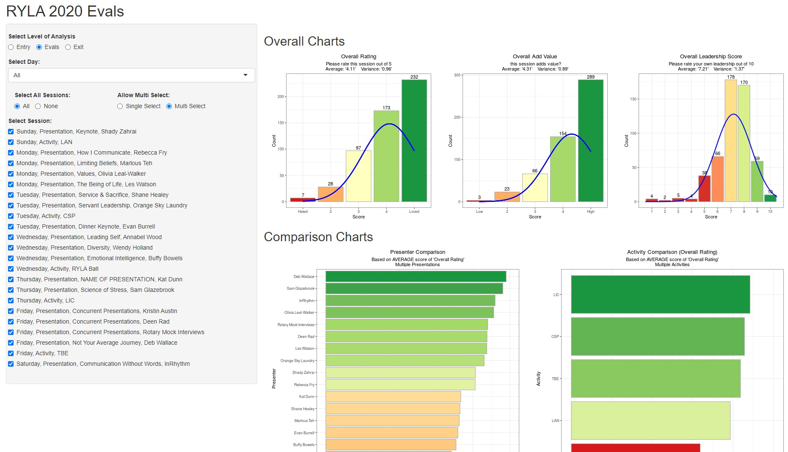

An App to analyse the Evaluation surveys completed by participants of the Rotary Youth Leadership Awards program.

<!-- 
Check it out: [ExploringUndernourishment](https://chrimaho.shinyapps.io/Shiny/)
-->

<!--more-->

Sorry, but I cannot provide a link to the actual App, due to confidentiality reasons.

App is hosted on on [ShinyApps](https://www.shinyapps.io/), and is written to support the [Rorary Youth Leadership Awards](http://d9685ryla.org.au/) Program.
