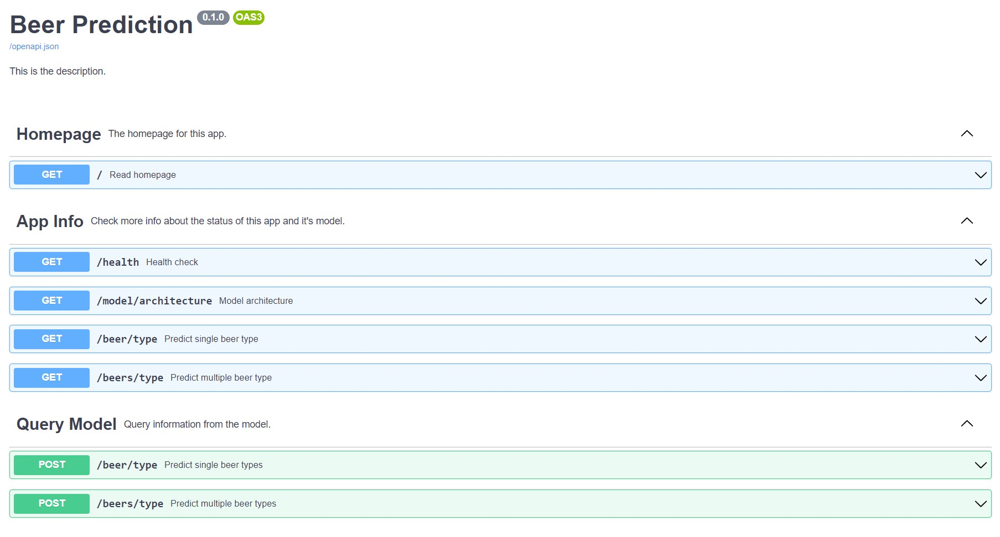

An App to explore the power of Neural Networks. It is hosted on on [Heroku](https://www.shinyapps.io/), is written in [Python](https://www.python.org/), it runs a [PyTorch](https://pytorch.org/) Neural Network, and is accessible through a set of defined [API](https://fastapi.tiangolo.com/)'s.

Using information such as Brewery Name, Aroma, Appearance, Palate and Taste, the App will predict the type of beer.

Check it out: [BeerPredictions](https://beer-prediction.herokuapp.com/)

<!--more-->

App is hosted on on [Heroku](https://www.shinyapps.io/). It is written in [Python](https://www.python.org/), and it runs a [PyTorch](https://pytorch.org/) Neural Network, and is accessible through a set of defined [API](https://fastapi.tiangolo.com/)'s.
