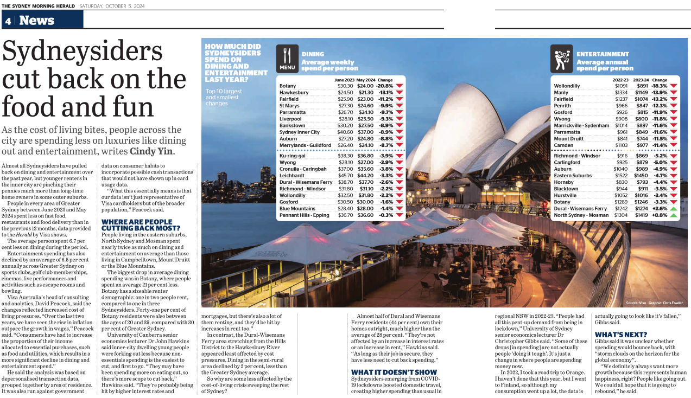
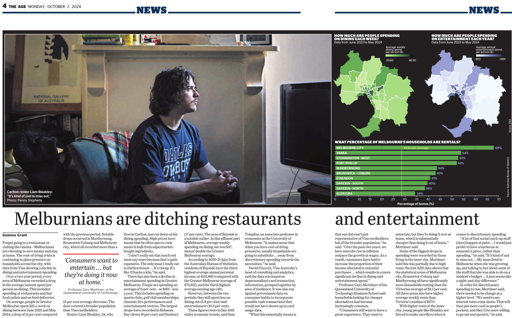

Over the last 9 months, the Visa Consulting & Analytics (VCA) Data Science team have developed a new capability which we call Data Normalisation. This enables us to scale up Visa’s aggregated and anonymised spend data to represent total retail spend by industry and geographic location. And to demonstrate this capability, we have collaborated with Craig Butt to reveal how much people have cut back on dining and entertainment and changed their spending behaviours as a result of cost-of-living pressures. 

<!--more-->

Our findings show significant nuances across the board, with some suburbs spending nearly twice as much on dining and entertainment than others. Across Greater Sydney, the average dining spending decreased by 6.5% while Sydney CBD saw a more pronounced drop of 8.8%. 

Such findings demonstrate the value of Visa's data in providing objective insights which guide strategic decisions and planning. Read the full article here for the full breakdown.

 





 
 



 

{{< blog-source
    url="https://www.theage.com.au/business/the-economy/see-the-spending-changes-in-your-area-as-cash-strapped-melburnians-ditch-dining-out-and-movies-20240913-p5kaf5.html?linkId=615861801"
    title="See the spending changes in your area as cash-strapped Melburnians ditch dining out and movies"
    subtitle="Using Normalised Spending Data from Visa"
    image="./assets/TA.jpeg"
    publicationlink="https://www.theage.com.au/"
    publicationname="The Age"
    publicationicon="./assets/TA_icon.ico"
>}}



 
 



[smh]: https://www.smh.com.au/national/nsw/the-sydney-areas-cutting-back-on-dining-and-entertainment-and-where-little-has-changed-20240919-p5kbw7.html?js-chunk-not-found-refresh=true
[ta]: https://www.theage.com.au/business/the-economy/see-the-spending-changes-in-your-area-as-cash-strapped-melburnians-ditch-dining-out-and-movies-20240913-p5kaf5.html?linkId=615861801

 

